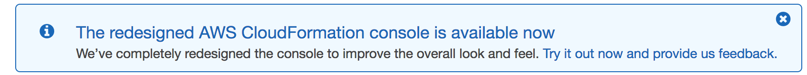
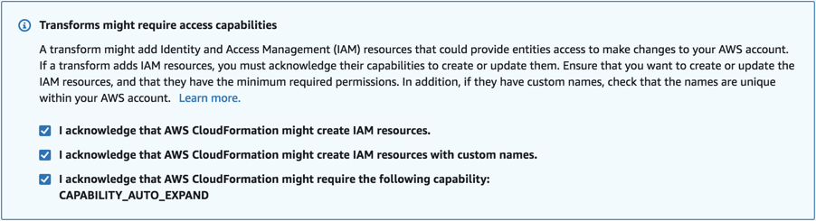

# workshop-sample

This project allows you to scaffold a workshop similar to those available at [cdkworkshop.com](https://cdkworkshop.com/), [eksworkshop.com](https://eksworkshop.com/), or [ecsworkshop.com](https://ecsworkshop.com/).

```bash
.
├── buildspec.yml                     <-- Build Spec used to build this project in CodeBuild
├── LICENSE.txt                       <-- License file
├── README.md                         <-- This instructions file
├── deck                              <-- Directory for presentation deck
├── images                            <-- Directory for GitHub README images
├── resources                         <-- Directory for workshop resources
│   ├── code                          <-- Directory for workshop modules code
│   ├── policies                      <-- Directory for workshop modules IAM Roles and Policies
│   └── templates                     <-- Directory for workshop modules CloudFormation templates
├── website                           <-- Directory for Hugo workshop website
└── workshop                          
    ├── buildspec.yml                 <-- AWS CodeBuild build script
    └── templates                     <-- Website Stack CloudFormation templates
        ├── pipeline-template.yaml    <-- Deployment pipeline from GitHub to static S3 website
        └── workshop-cloudfront.yaml  <-- CloudFront distribution for HTTPS access to S3 website
```

## Requirements

1. [Fork this repository](https://help.github.com/articles/fork-a-repo/).

2. Create a [GitHub personal OAuth access token](https://help.github.com/articles/creating-a-personal-access-token-for-the-command-line/).  `repo` permissions are required.

## Instructions

[Installing the Sample Workshop in your AWS Account](#installing-the-sample-workshop-in-your-aws-account)

## Install the Sample Workshop in your AWS Account

1. Complete the [Requirements](#requirements).

1. Click on the CloudFormation Launch link below that corresponds to the AWS Region in which you want to deploy the workshop.

    [](https://console.aws.amazon.com/cloudformation/home?region=us-east-1#/stacks/create/review?stackName=workshop-sample&templateURL=https://s3.amazonaws.com/workshop-sample-us-east-1/pipeline-template.yaml&param_GitHubBranch=master&param_GitHubRepository=workshop-sample)      


1. This workshop uses the CloudFormation CAPABILITY_AUTO_EXPAND capability, which requires the new CloudFormation Console UI.  If you see the following message at the top of the page, click on the link to **Try it out now and provide us feedback.** to use the new interface.

    

1. Once the CloudFormation **Quick create stack** page loads in your web browser, optionally update the **Stack name**.

1. In the **Parameters** section, provide values for:

    | Parameter | Description |
    | --- | --- |
    | GitHubBranch | The branch on the forked GitHub Repository that will trigger the pipeline (defaults to **master**) |
    | GitHubOAuthToken | The [GitHub personal OAuth access token](https://help.github.com/articles/creating-a-personal-access-token-for-the-command-line/) created in the [Requirements](#requirements) section |
    | GitHubRepository | The name of forked GitHub Repository (defaults to **workshop-sample**) |
    | GitHubUsername | The GitHub username of the forked GitHub Repository |

1. In the **Capabilities and transforms** section, check the following boxes:

    

1. If you don’t see a checkbox for CAPABILITY_AUTO_EXPAND, look for a message at the top of the page (image below) and click on the link to **Try it out now and provide us feedback.** to use the new interface.

    

1. Click the **Create stack** button.

1. Once the CloudFormation Stack has been created, click on the **Options** tab and note the value for **WebsiteURL**.

1. Paste the **WebsiteURL** into your web browser's URL address bar to visit the templated workshop website.

1. Congratulations!  You now have a working workshop website.
